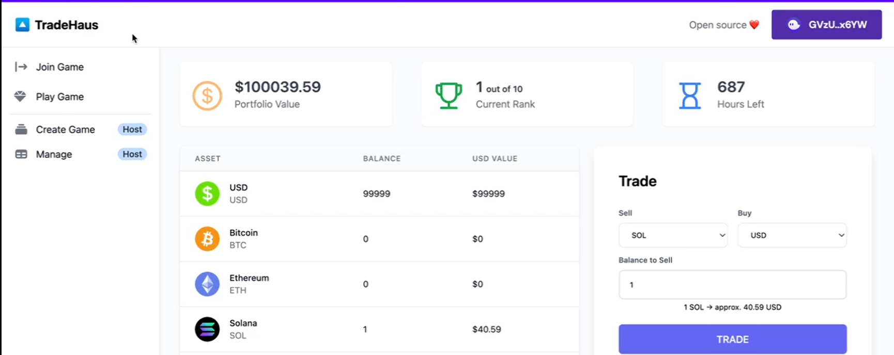

<!-- markdownlint-disable MD033 -->

<h1 align="center">Josh's GitHub Profile</h1>

Welcome to my Github profile. I am a web3 **BUIDLR** that develops community-first products. My development style is lean and agile.

## &nbsp; **2022 Major Projects**

### Tradehaus - Gamified Simulated Trading Platform (Chainlink Spring 2022 Hackathon)

The project was submitted as part of Chainlink Spring 2022 Hackathon organized by Chainlink. Our group identified a key problem with trading and that is, contrary to common belief, losing tons of money shouldn't be a rite of passage for newbies to try to pick up trading or investing. Instead, newbies should be given a safe environment, almost like a sandbox, for them to explore different trading strategies. At the same time, to simulate real trading evironment, we have introduced a gamified element to it in the form of a tournament where top winners will get rewarded. 

Over the course of the hackathon, my team prototyped a platform which serves as a Gamified Trading platform for users to play as well as for users to host/organize touraments with the ability to set certain conditions such as amount of rewards/type of rewards to be distributed, number of players etc. The winner/s is decided based on the final portfolio balance and distribution is done via a trustless escrow. 

Find out more about the project at our repository:

<https://github.com/bubu59/tradehaus-program.git>

</a> 
  
### 💸: Staking - Yield Farming
 

Yield Farming smart contract where users can stake their SOL to earn native tokens. Breeding logic is done off-chain to save gas costs. 

### :moneybag: PredSoL - SOL Prediction Game

Prediction Game where users can bet on whether the price of SOL will go up or down in a specified timeframe. Price of SOL is retrieved from the SOL/USD Chainlink Oracle.

## 🔧 &nbsp;**Current Tech Stack**

## 🧰 &nbsp;**Unused Tech**

