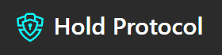

<!-- markdownlint-disable MD033 -->

<h1 align="center">Josh's GitHub Profile</h1>

   

Welcome to my Github profile. I am a web3 **BUIDLR** that develops community-first products. My development style is lean and agile.

## &nbsp; **2022 Major Projects**
  
### HoldProtocol - Web3 Contract Security Platform (Solana Summer Camp 2022 Hackathon)

The project was submitted as part of Solana Summer Camp 2022 Hackathon organized by Solana. Our group identified a key problem with the security of protocols. More specifically, the lack of immediate attention and ability to report and freeze a potential hacker's account. 

Over the course of the hackathon, my team prototyped a platform which serves as an avenue for users and protocols alike to submit potential hack reports which will then be investigated by a team of white hats such as OtterSec and the funds in question will be frozen until investigations are complete. 

Find out more about the project at our repository:

<https://github.com/bubu59/solana-summer-camp-22.git>

</a> 
  

### MobiusProtocolPL - Web3 Crowdfunding Platform (Solana Summer Camp 2022 Hackathon)

The project was submitted as part of Solana Summer Camp 2022 Hackathon organized by Solana. Our group identified a key problem with Fundraising and that is 85% of startups delay the delivery, and 14% don’t deliver at all what was promised to the angel investors. As of today, crowdfunding platforms have accountability and trust problems. In many cases, money from investors has gone into wrong campaigns and has been misused
  
Over the course of the hackathon, my team prototyped a platform which serves as a Crowdfunding platform investors can know to whom the money is going and how they are spending it. A smart contract helps to block the funds within blockchain until the project or startup founder makes progress in the project.

Find out more about the project at our repository:

<https://github.com/bubu59/MobiusProtocolPL.git>

</a> 

### Tradehaus - Gamified Simulated Trading Platform (Chainlink Spring 2022 Hackathon)

The project was submitted as part of Chainlink Spring 2022 Hackathon organized by Chainlink. Our group identified a key problem with trading and that is, contrary to common belief, losing tons of money shouldn't be a rite of passage for newbies to try to pick up trading or investing. Instead, newbies should be given a safe environment, almost like a sandbox, for them to explore different trading strategies. At the same time, to simulate real trading evironment, we have introduced a gamified element to it in the form of a tournament where top winners will get rewarded. 

Over the course of the hackathon, my team prototyped a platform which serves as a Gamified Trading platform for users to play as well as for users to host/organize touraments with the ability to set certain conditions such as amount of rewards/type of rewards to be distributed, number of players etc. The winner/s is decided based on the final portfolio balance and distribution is done via a trustless escrow. 

Find out more about the project at our repository:

<https://github.com/bubu59/tradehaus-program.git>

</a>   

## 🔧 &nbsp;**Current Tech Stack**

## 🧰 &nbsp;**Unused Tech**

